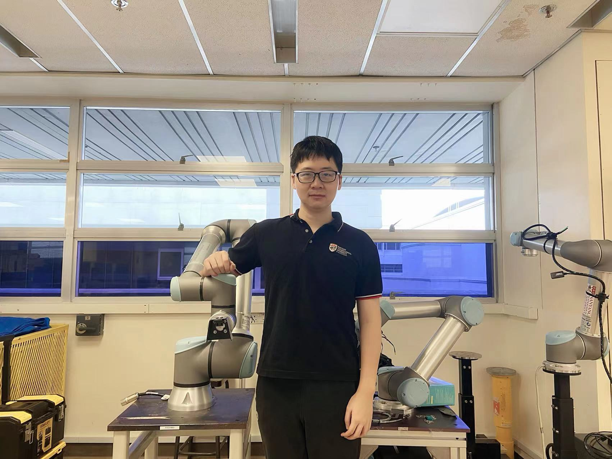








# About Me 
 

From 2022, Huixu Dong is a “New Hundred-Talent Program” faculty (浙江大学“新百人计划研究员”/博导) in the Department of Mechanical Engineering at Zhejiang University, and the Director of Robotic perception and Grasp Lab (RPGL) or Grasp Lab(GL) in short. I received the B.Sc degree in Mechatronics Engineering from Harbin Institute of Technology (HIT) in 2013 and obtained Ph.D. degree at Robotics Research Centre (RRC) of Nanyang Technological University (NTU) Singapore in 2018 advised by Prof.I-Ming Chen. Before joining Zhejiang University, I was a post-doctoral fellow of Robotics Institute (RI) at Carnegie Mellon University (CMU) and National University of Singapore (NUS). 

# Research Interests 
 

I am mainly robotic perception and manipulation, including general-purpose grasp, dynamic grasping, dexterous manipulation, and in-hand manipulation. I am interested in studying a challenging problem of efficiently understanding scenarios, reasoning about the grasping trajectory, and carrying out a reliable physical-environment grasping action for constructing an optimized system to perform robust manipulations for domestic, supermarket, warehouse and industrial setting applications. I am motivated by the above problem and working on offering highly resultful solutions through mathematical modeling, gripper design and control, visual perception as well as self-supervision robotic learning. 

# News 

 - * 2022.Jun 30 *: &nbsp;  A paper on the construction of a compliant gripper was accepted by IEEE/RSJ International Conference on Intelligent Robots and Systems (<b>IROS 2022</b>). 

 - * 2022.Jun 30 *: &nbsp;  A paper on the construction of a parallel gripper was accepted by IEEE/RSJ International Conference on Intelligent Robots and Systems (<b>IROS 2022</b>). 

- * 2022.Jun 15 *:  &nbsp;  I have opened multiple fully-funded PostDoc, research associate (master's degree) and research officer (Bachelor's degree) positions in robotic perception and grasp.  欢迎具有机械电子、计算机、控制、电子、力学、材料、生物、化学等背景的博士后，博士，硕士、本科生加入机器人感知与抓取实验室, 感兴趣的同学请发邮件。
   

 - * 2022.Jun 10 *: &nbsp;  A paper on the construction of a soft gripper was accepted by IEEE Robotics and Automation Letters (<b>RA-L</b>). 
 
 - * 2022.Jun 09 *: &nbsp;  A paper on the theory of nonredundant parallel manipulators was accepted by Mechanism and Machine Theory (<b>MMT</b>). 
  

 - * 2022.Jun *: &nbsp;  After a 10-year wonderful and unforgettable time in Singapore and United States, I joined Zhejiang University ME to start my academic faculty journey. 

# Key Activities

  
 
 &#x2022; Associate Editor(AE), IEEE Robotics and Automation Letters (RA-L) (2022 - 2025)
 
 
 <li>Associate Editor(AE), IEEE/RSJ International Conference on Intelligent Robots and Systems(IROS 2022)<li>
  
 
 <li>Associate Editor(AE), IEEE/ASME International Conference on Advanced Intelligent Mechatronics(AIM 2022)<li>

 
 <li>Member of T-Mech Junior Reviewers Program (TJRP), IEEE/ASME Transactions on Mechatronics(T-Mech 2021-2024)<li>

# Publications 

## *Journal papers* &nbsp;
  

T-RO Long paper

 

 
 <b>Real-time Robotic Manipulation of Cylindrical Objects in Dynamic Scenarios through Elliptic Shape Primitives</b>
 
  

 <b>H. Dong</b>, E. Asadi, G. Sun, D. K. Prasad, IM. Chen. 
 

 <i>IEEE Transactions on Robotics</i>(<b>T-RO Long paper</b>), 2018.
   

RCIM

 

 <b>Geometric design optimization of an under-actuated tendon-driven robotic gripper</b>
  

 <b>H. Dong</b>, E. Asadi, C. Qiu, J. Dai, and IM. Chen.
 

 <i>Robotics and Computer-Integrated Manufacturing</i>(<b>RCIM</b>), 2017.
   

T-ASE

 <b>Enabling Robotic Grasp: Object Pose Estimation via Pruned Hough Forest with Combined Split Schemes</b>
  

 <b>H. Dong</b>, DK Prasad, IM. Chen.
 

 <i>IEEE Transactions on Automation Science and Engineering</i>(<b>T-ASE</b>), 2020.
    
  

RA-L

 <b>Fast Ellipse Detection for Robotic Manipulation of Cylindrical Objects</b>
  

 <b>H. Dong</b>, E. Asadi, C. Qiu, J. Dai, and IM. Chen.
 

 <i>IEEE Robotics and Automation Letters</i>(<b>RA-L</b>), 2018.
      

MMT

 <b>Enabling grasp action: Generalized quality evaluation of grasp stability via contact stiffness from contact mechanics insight</b>
  

 <b>H. Dong</b>, C Qiu, DK Prasad, Y Pan, J Dai, IM Chen.
 

 <i>Mechanism and Machine Theory</i>(<b>MMT</b>), 2019.
      
 

MMT

 <b>Grasp analysis and optimal design of robotic fingertip for two tendon-driven fingers</b>
  

 <b>H. Dong</b>, E. Asadi, C. Qiu, J. Dai, and IM. Chen.
 

 <i>Mechanism and Machine Theory</i>(<b>MMT</b>), 2018.
    
  

PR

 

 <b>Accurate detection of ellipses with false detection control at video rates using a gradient analysis</b>
  

 <b>H. Dong</b>, D. K. Prasad, and IM Chen.
 

 <i>Pattern Recognition</i>(<b>PR</b>), 2017.
  

RA-L

 <b>GSG: A Granary Soft Gripper with Mechanical Force Sensing via 3-Dimensional Snap-Through Structure</b>
  

 <b>H. Dong</b>, CY Chen, C Qiu, CH Yeow, H Yu.
 

 <i>IEEE Robotics and Automation Letters</i>(<b>RA-L</b>), 2022.

  

T-Mech

 <b>Real-time Avoidance Strategy of Dynamic Obstacles via Detection and Tracking with 2D Lidar for Mobile Robot</b>
 

 <b>H. Dong</b>,  CY Weng, CQ Guo, H Yu, IM Chen.
 

 <i>IEEE/ASME Transactions on Mechatronics</i>(<b>T-MECH</b>), 2020.

  

 MMT

 <b>Repelling-screw-based geometrical interpretation of dualities of compliant mechanisms</b>
 

 <b>H. Dong</b>,  K Wang, C Chen, IM Chen, J Dai.
 

 <i>Mechanism and Machine Theory</i>(<b>MMT</b>), 2021.

  

SORO

 <b>Bio-inspired Amphibious Origami Robot with Body Sensing for Multimodal Locomotion</b>
 

 <b>H. Dong</b>,  HT Yang, S Ding, T Li, H Yu.
 

 <i>Soft Robotics</i>(<b>SORO</b>), 2022.

  

TITS

 <b>Are object detection assessment criteria ready for maritime computer vision?</b>
 

 DK. Prasad, <b>H. Dong</b>, Deepu Rajan, and Chai Quek.
 

 <i>IEEE Transactions on Intelligent Transportation Systems</i>(<b>TITS</b>), 2019.
 

MMT

 <b>A Repelling-Screw-Based Approach for the Construction of Generalized Jacobian Matrices for Nonredundant Parallel Manipulators</b>
 

 Kun Wang, <b>H. Dong</b>, Emmanouil Spyrakos-Papastavridis, Chen Qiu, Jian S. Dai.
 

 <i>Mechanism and Machine Theory</i>(<b>MMT</b>), 2022.
   

## *Conference papers* &nbsp;

 IROS 2018 

 <b>Efficient Pose Estimation from Single RGB-D Image via Hough Forest with Auto-context</b>
 

 <b>H. Dong</b>, D. K. Prasad, Q.Yuan, J.Zhou, E.Asadi, IM. Chen.
 

 <i>IEEE/RSJ International Conference on Intelligent Robots and Systems</i>(<b>IROS</b>), 2018.
 
  

 IROS 2018 - RA-L 

 <b>Fast Ellipse Detection for Robotic Manipulation of Cylindrical Objects</b>
 

 <b>H. Dong</b>, G.Sun, W.-C.Pang, E.Asadi, D.K.Prasad, IM. Chen
 

 <i>IEEE/RSJ International Conference on Intelligent Robots and Systems</i>(<b>IROS - RA-L</b>), 2018.
  

 ICIP 2017 

  

 <b>Robust Ellipse Detection Via Arc Segmentation and Arc Classification</b>
 

 <b>H. Dong</b>, IM. Chen, and D. K. Prasad
 

 <i>International Conference on Image Processing</i>(<b>ICIP</b>), 2017.
   
 

 ICRA 2022 

 <b>Learning-based Ellipse Detection for RoboticGrasps of Cylinders and Ellipsoids</b>
 

 <b>H. Dong</b>, J Zhou, C Qiu, DK Prasad, IM. Chen.
 

 <i>IEEE International Conference on Robotics and Automation</i>(<b>ICRA</b>), 2022.
    
  

 ICRA 2022 

 <b>Estimation of Upper Limb Kinematics with a Magnetometer-Free Egocentric Visual-Inertial System</b>
 

 T Li, X Wu, <b>H. Dong</b>, Haoyong Yu.
 

 <i>IEEE International Conference on Robotics and Automation</i>(<b>ICRA</b>), 2022.
    

  
  
# Projects

# Grasp Lab

## *Constructing the Lab* &nbsp;

### *&#x2022; Current members* &nbsp;

  

    
    

Huixu Dong, Principle Investigator(PI)
 
                              

                           
    

  

    
    
 
Jiadong Zhou, Ph.D. Student, co-advised with Prof.Chen IM
 
                              
Robotic  re-grasping 
 
                               

    

  

    
    
 
Yue Feng, Ph.D. Student, co-advised with Prof.Chen IM.

                              
Human-guided robotic manipulation
 
                        
     

  

### *&#x2022; Robot buddies* &nbsp;

  

    
    
UR5

  

  

    
    
Panda

  

  

    
    
Iiwa

  

## *Joining My Group* &nbsp;

 
  
  <li>For current master's and undergraduate students with mechanical engineering, computer science, control engineering, electronics, mathematics mechanics, material and biology, and chemistry backgrounds at ZJU, please feel free to contact me by email (I am in general going to reply to emails on Friday or Saturday) if you are interested in joining my group.</li>
  
  <li>For perspective PhD/master students, please apply to the Master/Ph.D. program in ME of ZJU and mention my name in application letters if you are interested in joining my group. </li>
  
  <li>Also, I have opened multiple fully-funded PostDoc, research associate (master's degree) and research officer (Bachelor's degree) positions in robotic perception and grasp.</li>
  
  欢迎具有机械电子、计算机、控制、电子、力学、材料、生物、化学等背景的博士后，博士，硕士、本科生加入机器人感知与抓取实验室, 感兴趣的同学请发邮件。
  

## *Target* &nbsp;

 

  It is well-known that a robotic grasping system significantly involves perception, modeling, gripper design and control, motion planning and materials, even emerging technologies such as VR and metaverse. Our research locates in those disciplines of robotic vision, mechatronics and motion planning. Our goal is to develop cutting-edge technologies of robotic perception and grasp to achieve domestic and industrial applications. To this end, we focus on (1) developing grippers with new concepts, new design, new control, new actuator, and new material; (2) studying real-time shape-based and 3D perceptions via mathematical modeling and machine learning; (3) investigating safe, interactive motion planning and grasping synthesis; (4) exploring supervision learning for robots commanding skills. Currently, we are working on robotic tidying, packaging, assembling, picking, placing, and re-grasping projects. 

## *Supervising statement* &nbsp;

 
 
  The Grasp Lab is committed to fostering creativity, opening, inclusion, and collaboration among our members with diverse backgrounds. <b>We strive to offer supportive environments for students to implement any novel ideas that break research borders, regardless of specific-purpose applications.Our lab highly encourages students to cooperate with other groups since robotics research is an interdisciplinary and collaborative endeavor.</b> For each incoming member, we advise a suitable research direction and also, have a weekly meeting with each member. We set up a weekly meeting to inspire brainstorming, discuss literature studies and research ideas. Generally, we will allow students to do visiting students overseas such as RRC at NTU in Singapore, RI at CMU in United States, and some universities in Norway, Australia, England, Japan, and Finland.

